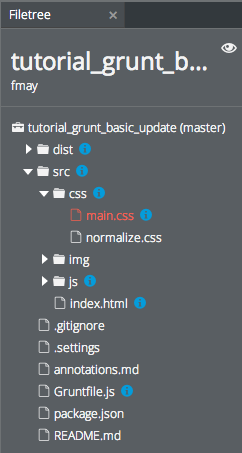

@annotation:file src
#Source folder
This is where our source content is located. Grunt's `copy` task will copy the entire contents to the `dist` folder. We have configured all subsequent Grunt tasks to operate on this folder.

@annotation:file dist
#Destination folder
This is where Grunt will write all of its output. Compare some of the files in the `dist` folder with their counterparts in the `src` folder. You can see that many files are cache-busted (file names are prefixed with a has value). You can also see that the CSS (and JS) folder contains a file called `abcd.optimized.js` which contains minified and concatenated contents of the source files.

Although the original files are still there, they are not actually used in production.

If you look at the `dist/index.html` file, you will see how the references have been fixed up by Grunt.

@annotation:file src/index.html
#index.html
This contains some interesting stuff. You will see the following code within it that is used by the `usemin` task.

    <!-- build:css css/optimized.css -->
    <link rel="stylesheet" href="css/normalize.css">
    <link rel="stylesheet" href="css/main.css">        
    <!-- endbuild -->
    
    <!-- build:js js/optimized.js -->
    
            
    <!-- endbuild -->
        
The `<!-- build:css css/optimized.css -->` comment is used by `usemin` so it knows where to fix up references to concatenated and cache-busted files. If you look at `index.html` within the `dist` folder, you will see the generated references, that look something like this

    <link rel="stylesheet" href="css/ec54.optimized.css"/>
    

@annotation:file src/css/main.css
#main.css
You can see that our CSS file contains a reference to an image

    background-image:url('../img/grunt.png');
    
Grunt will cache bust this image and the `usemin` task fixes up the reference to something like

    background-image:url('../img/dcae.grunt.png');

@annotation:file src/css
#CSS file concatenation & cache-busting
This folder contains two CSS files, which are referenced from `src/index.html`. Grunt combines these files into a single file (concat task), then cache busts them by prefixing the files with a hash string (rev task).

Look at the same build folder `dist/css` and you will see a file call `xxxx.optimized.css`, which is the concatenated, cache-busted file, generated by Grunt.

Now compare the `src/index.html` with `dist/index.html` and you will see how the reference has been fixed up.

This fixing up is managed by the `usemin` tasks. You can read about this by opening `Gruntfile.js` and then clicking on the blue icon on the `useminPrepare` code line.

@annotation:file src/js
#JS file concatenation & cache-busting
This folder contains two JS files, which are referenced from `src/index.html`. Grunt combines these files into a single file (concat task), then cache busts them by prefixing the files with a hash string (rev task).

Look at the same build folder `dist/js` and you will see a file call `xxxx.optimized.js`, which is the concatenated, cache-busted file, generated by Grunt.

Now compare the `src/index.html` with `dist/index.html` and you will see how the reference has been fixed up.

This fixing up is managed by the `usemin` tasks. You can read about this by opening `Gruntfile.js` and then clicking on the blue icon on the `useminPrepare` code line.

@annotation:file Gruntfile.js
#The Grunt file
This is where the magic happens. All build tasks are contained within this file and the tutorial will concentrate heavily on explaining it.

Select `Tools->Annotations Tour` to start the guided tour.

@annotation:snippet fixup
#Fixing up references
You will see here that there are references to 2 .js files and 2 .css files. Our Grunt operation will concatenate and cache-bust these 2 sets of files. Once this has been done, we will end up with a new .js file `hash.optimized.css` and `hash.optimized.js`.

However, this means that the references in this `index.html` file will be invalid. The good news is that `usemin` Grunt task will update these references in the `dist` folder. 

Take a look at `dist/index.html` to see result.

The `rev` task in `Gruntfile.js` is responsible for cache-busting.

@annotation:snippet cs-image
#Fixing up image references
Our CSS file references an image. Our Grunt operation cache-busts images by prepending a hash, so references to those images need to be fixed up.

Take a look in the `dist/img` folder and you'll see the new, cache-busted image name. Look at the `dist/css/main.css` file and you'll see that the image name matches.

The `rev` task in `Gruntfile.js` is responsible for cache-busting.

@annotation:tour
#Introduction
Grunt will be known to many developers but if you have not used it before, we've put together a detailed Grunt tutorial that shows a typical use case.

Grunt is a task runner that runs operations on your files. Grunt tasks can be applied to all of your front and back end code. Here are just a few of the many tasks that have been built by the Grunt community.

- **Minify** - minifies js and css files
- **Concat** - joins js and css files into a single file to speed up page load
- **Copy** - copy files from a source location to a destination location
- **Rev** - static file revisioning using hashing, great for cache busting
- **Usemin** - fixes up references to .js and .css files within a set of HTML files (or any templates/views), once those .js and .css files have been concatenated and/or cache-busted.

Use the navigation buttons at the top to move through the tour.

##Grunt Site
You should visit the [Grunt Site](http://gruntjs.com) to get a comprehensive overview of Grunt. There is also a [list of all publicly available Grunt Plugins](http://gruntjs.com/plugins).

@annotation:tour
#Getting stuff installed
The first thing we need to do is to install the Grunt command line tool and then install Grunt itself.

Open up a terminal tab from the Tools->Terminal menu then enter these two commands

    npm install -g grunt-cli
    npm install

`npm` is the Node Package Manager, which comes preinstalled on your Codio Box. 

Running `npm install` checks the `package.json` file and then installs all the packages your project needs into the `node_module` folder.

If you look in the file tree on the left, you should now see this folder.

@annotation:tour
#About the Codio Tutorial

##Navigating through the tutorial
You can use the navigation buttons at the top of this page to move from one section to the next. Where it references code snippets (which happens in a moment) you will see the page split.

##Exploring the file tree
Wherever you see a blue 'i' icon in the filetree, you can click on it and it will show you some contextual information.

##Creating your own Tutorials
You can easily create your own tutorials using Codio. [Click here](https://codio.com/s/docs/annotations/) to find out how.

@annotation:tour use-case
##Our Use Case
We take a very simple HTML5 boilerplate type application and perform the following tasks to prepare it for production.

You can click on the task names below to see the Grunt task modules described in the npm site. You will find these tasks referred to in `gruntfile.js` which we will look at in the next section.

1. [clean](https://npmjs.org/package/grunt-contrib-clean) - this empties the contents of the `dist` folder where our production content is written to by Grunt
1. [copy](https://npmjs.org/package/grunt-contrib-copy) - we copy the entire contents of the `src` folder into the `dist` folder ready for processing
1. [useminPrepare](https://npmjs.org/package/grunt-usemin) - this is the step that requires most understanding. I'll explain it in detail in the Tasks section so as not to make this summary too messy. In summary, it analyzes your project ready for concatenation, uglification and minification and will auto generate these tasks.
1. [concat](https://npmjs.org/package/grunt-contrib-concat) - we want to concatenate all `.js` and `.css` files into 2 individual files so that the site loads faster.
1. [uglify]() - minifies `.js` files
1. [cssmin](https://npmjs.org/package/grunt-contrib-cssmin) - minifies `.css` files
1. [rev (images)](https://npmjs.org/package/grunt-rev) - cache busting of images by prefixing file names with a hash to make them unique.
1. [usemin (css)](https://npmjs.org/package/grunt-usemin) - we now fix up references within our css files to any images, bearing in mind that the above image cache-busting task will have changed image file names. More on this later.
1. [rev (js and css)](https://npmjs.org/package/grunt-rev) - now that the `.css` and `.js` files have been minified and concatenated, we will cache-bust them, too.
1. [usemin (html)](https://npmjs.org/package/grunt-usemin) - the final step is to fix up the references within our `index.html` file to `.js` and `.css` files, bearing in mind that the concatenation and cache-busting tasks will have changed their file names.

Once these steps run, the `dist` folder will contain our production ready content ready for deployment.

@annotation:tour gruntfile
#Gruntfile.js
This is the magical Grunt file. All Grunt related tasks are defined here. There are three main areas you will need to configure

1. The tasks themselves (inside the JSON structure)
1. Loading the NPM modules associated with each tasks
1. Configure task names by providing a task name along with the associated task you wish to run. 

We'll now examine these 3 things.

###A Basic Grunt file

    module.exports = function(grunt) {
    
        grunt.initConfig({
    
            // This line is required and reads in package.json
            // which is present in the root of your project
            pkg: grunt.file.readJSON('package.json'),
    
            // User can customize everything starting here  
    
            // 'clean' tasks
            clean: {
                build: ['dist']
            },
    
            // 'copy' task
            copy: {
                main: {
                    files: [{
                        dest: 'dist/',
                        src: ['**'],
                        cwd: 'src/',
                        expand: true
                    }]
                }
            }
            
            // .. and this is the end of the task block
                      
        });
        
        // Each task has its module loaded here
        grunt.loadNpmTasks('grunt-contrib-clean');
        grunt.loadNpmTasks('grunt-contrib-copy');
        
        // And here we register collections of tasks together
        // 'default' tasks will run when you run grunt without a parameter
        grunt.registerTask('default', ['clean', 'copy']);
        // Other operations can be defined as well
        grunt.registerTask('prep', ['clean']);
    
    };

@annotation:tour grunt-tasks
#Defined Grunt Tasks
The large highlighted section of code on the left is where you define your tasks in detail. The following shows the [copy](https://npmjs.org/package/grunt-contrib-copy) task along with its parameters.

    copy: {                       // task name
        main: {                   // sub-task name (can be anything)
            files: [{             // file copying options
                dest: 'dist/',    // name of the destination folder
                src: ['**'],      // location of the parent folder
                cwd: 'src/',      // 'current working direct' within the src folder
                expand: true      // process all folders and sub-folders
            }]
        }
    }

###Details on each Task
Each task can be examined in more detail by clicking on the blue icon in the gutter.

###Usemin - a minor headf***
One thing you will notice if you examine the task list is that there are no specific tasks for `concat`, `cssmin` and `uglify` yet these tasks are actually being invoked. 

This is because `usemin` is performing some magic in the background. Click on the blue icon on the `useminPrepare` line for more details.

@annotation:snippet task-clean
For details on `clean`, see [grunt-clean](https://npmjs.org/package/grunt-clean)

This removes files and folders from `dist` folder ready for the next operations.

@annotation:snippet task-copy
This copies files from the source folder to the destination folder. Once the copy has been done, all other tasks will operate on these copied files in the `dist` folder.

    copy: {                       // task name
        main: {                   // sub-task name (can be anything)
            files: [{             // file copying options
                dest: 'dist/',    // name of the destination folder
                src: ['**'],      // location of the parent folder
                cwd: 'src/',      // 'current working direct' within the src folder
                expand: true      // process all folders and sub-folders
            }]
        }
    }

@annotation:snippet task-useminPrepare
For details on `usemin`, see [grunt-usemin](https://npmjs.org/package/grunt-usemin)

`usemin` is a clever, but complex, task that takes file references within files and then fixes them up after the referenced files names have modified by Grunt tasks such as cache-busting and concatentation.

For example, our project's `index.html` references css and javascript files

    <!-- build:css css/optimized.css -->
    <link rel="stylesheet" href="css/normalize.css">
    <link rel="stylesheet" href="css/main.css">        
    <!-- endbuild -->
    
    <!-- build:js js/optimized.js -->
    
            
    <!-- endbuild -->

After concatenation and cache-busting, the two CSS files and the two JS files will be concatenated and cache-busted to end up with 2  single files, something like

    abcd.optimized.css
    efgh.optimized.js
    
The `useminPrepare` task analyzes the files you point it to (in our project `dist/index.html`, in other words the freshly copied files) and then in the `options` parameter, we specify the destination folder.

If you run `grunt prep` our Gruntfile only runs the clean, copy and useminPrepare tasks. If you look at the console output, you will see that `useminPrepare` is actually generating some tasks on the fly. The same output is generated by `grunt` (runs the `default` tasks) along with the all the other tasks.

    concat: {
        generated: {
            files: [{
                dest: '.tmp/concat/css/optimized.css',
                src: ['dist/css/normalize.css', 'dist/css/main.css']
            }, {
                dest: '.tmp/concat/js/optimized.js',
                src: ['dist/js/plugins.js', 'dist/js/main.js']
            }]
        }
    }
    uglify: {
        generated: {
            files: [{
                dest: 'dist/js/optimized.js',
                src: ['.tmp/concat/js/optimized.js']
            }]
        }
    }
    cssmin: {
        generated: {
            files: [{
                dest: 'dist/css/optimized.css',
                src: ['.tmp/concat/css/optimized.css']
            }]
        }
    }

These tasks are inserted into your Gruntfile for the duration of execution only. They will be run as soon as the actual `usemin` task is invoked.

You can see from the above output how `concat`, `uglify` and `cssmin` tasks will be executed when `usemin` is invoked.

The main responsibility of `usemin` is to fix up all references to any files in the `index.html` file. We had

    <!-- build:css css/optimized.css -->
    <link rel="stylesheet" href="css/normalize.css">
    <link rel="stylesheet" href="css/main.css">        
    <!-- endbuild -->
    
... which, after concatenation and cache-busting becomes something like (hash value will vary)

    <link rel="stylesheet" href="css/ec54.optimized.css"/>

But, `usemin` also fixed up references in other files. For example, our `src/css/main.css` file contains the following reference 

    background-image:url('../img/grunt.png');
    
... which gets fixed up (in `dist/css/main.css`) to 

    background-image:url('../img/dcae.grunt.png');

This then gets concatenated and cache-busted along with `normalize.css` into `abcd.optimized.css`. The same procedure runs on the js files.

##Options
We use following options (there are many more available) within the task

-  `html` - the location of the root html file
-  `options:dirs` - the folder to process

@annotation:snippet task-rev
For full details on `rev` see [grunt-rev](https://npmjs.org/package/grunt-rev)

This task generates hashes that are prepended to file names in order to ensure any previous files are not served up from the browser's cache. This is know as 'cache busting'. Whenever this task is run, new hashes will be generated.

You will see that there are two sub-tasks for this task, `img` and `jscss`. Due to the fact that our task workflow requires that images are fixed up before js and css files, we have defined these two sub-tasks. If you look at the end of `Gruntfile.js`, you will see that our operation invoked the tasks as follows (extract)

    ...., 'rev:img', 'usemin:css', 'rev:jscss', 'usemin:html' ....
    
We need to have the right sequence of execution as follows

1. We first cache-bust the image names with `rev:img` as our css files may reference these. 
1. Now, `usemin:css` is run to fix up references to any file names references by the css.
1. Next, we can cache-bust the css (and js) file with `rev:jscss`.
1. Finally, we can fix up the references to the js and css files within `index.html`.
There a parameters set to control the way the hashing is done

    algorithm - the hashing algorithm used ('sha1', 'md5', 'sha256', 'sha512', etc.)
    length - the number of characters the hash should return
    files:src - the folder to search in along with any filters
    
Refer to [grunt-rev](https://npmjs.org/package/grunt-rev) for details.

@annotation:snippet task-usemin
For details on `usemin`, see [grunt-usemin](https://npmjs.org/package/grunt-usemin)

Please refer to the `useminPrepare: {` task higher up the `Gruntfile.js` as well as as the `rev` task annotation, where this is all described in detail. 

**IMPORTANT** : although `useminPrepare` prepares the `concat`, `uglify` and `cssmin` tasks, it does not ensure that they are executed. To ensure this, you should include them in `grunt.registerTask` at the bottom of `Gruntfile.js`. You can see them here 

    grunt.registerTask('default', ['clean', 'copy', 'useminPrepare', 
        'concat', 'uglify', 'cssmin', 'rev:img', 
        'usemin:css', 'rev:jscss', 'usemin:html']);

##Sub Tasks
Because we want to be able to process the `index.html` and the css/js files at different points in the workflow, we have configured 2 subtasks, `html: ['dist/*.html']` and `css: ['dist/**/*.css']`.

Each of these tasks specifies the folders and file types to operate on. You can see how `grunt.registerTask()` invokes `usemin:css` and `usemin:html` at separate points in the workflow.
    

@annotation:tour load-tasks
#Load Grunt Modules
You need to explicitly load each NPM module that handles a task. You can look up NPM modules in [http://gruntjs.com/plugins](http://gruntjs.com/plugins).

@annotation:tour register-tasks
This is where you register one or more tasks with Grunt so they can be called from the command line. The format is

    grunt.registerTask('operation_name', ['task_1', 'task_2', ... , 'task_n']);
    
You can specify more than one `task_name` as shown in this example, where we have defined `default` and `prep`. 

Now, we can run the following tasks from the command line 

`grunt` (with no second parmater) runs the 'default' registered task 
 `grunt prep` runs the 'prep' registered task.

@annotation:tour run
#Running your Grunt tasks
Now, you're ready to run your Grunt task. 

Enter `grunt` in your terminal window.

There is a lot of verbose output which tells you exactly what tasks were run and the order in which they were run.

This output is useful for troubleshooting and, in our example, it shows you the auto-generated tasks created by the `useminPrepare` task.